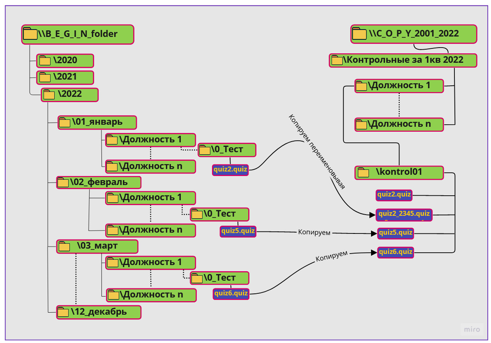

# patch_file #
## Введение ##
На необъятных просторах Телеграмма, возникла идея и одновременно проблема в реализации у _Ивана Т_. 
Как известно, лень - двигатель прогресса, поэтому идея заключалась в уменьшении ручного труда
 и утомляемости на работе у _Ивана_, дело осталось за автоматизацией.  
Почему бы не помочь? Задача реальная, выполнимая, исключающая монотонность действий.
***
## Задача ##  
Есть некоторое предприятие, которое периодически тестирует своих сотрудников. 
Для каждой должности, свои тесты.  

+ Есть две сетевых "шары". Одна (далее в программе _B_E_G_I_N_folder_), хранит в себе тесты, со следующей 
файловой структурой _\\B_E_G_I_N_folder\_ГГГГ\MM_Месяц\Должность_. Другая, следующей структуры
_\\C_O_P_Y_2001_2022\Контрольные за 3кв 2022\Должность\kontrol01_.  
+ Обе сетевые директории находятся Linux сервере. Samba - танцуют все!
+ "_Раз в квартал, мне необходимо собирать файлы с тестами по трём месяцам и объединять в один тест._" 
Для этого, файлы с расширением .quiz из первой папки за квартал, необходимо скопировать во вторую папку. Причём, в
исходной папке, "_нужно сузить поиск до папки "0_Тест"_".
+ Если "_в конечной папке файл с тем же именем существует, то необходимо переименовать копированный файл_". Буду
рандомно добавлять четыре цифры к имени файла.
+ "_Хочу, чтобы был скрипт с консольным или графическим интерфейсом, в котором можно было выбирать для какого квартала
 собирать тесты_". С консольным приложением не вопрос, с GUI можно с помощью Tk сделать, но решил попробовать библиотеку wxPython.
  
***  
### Используемые технологии ###

|                    -                     |                Ссылки                 |                  Описание                   |
|:----------------------------------------:|:-------------------------------------:|:-----------------------------------------------------------------------------------------------------------------------------------------------|  
|  | [Python 3.8](https://www.python.org/) | Высокоуровневый язык программирования общего назначения с динамической строгой типизацией и автоматическим управлением памятью                 |
|                    -                     |                 glob                  |Модуль glob находит все пути, соответствующие указанному шаблону, в соответствии с правилами, используемыми оболочкой Unix. Результаты возвращаются в произвольном порядке. |  
|                    -                     |                shutil                 |Модуль shutil содержит набор функций высокого уровня для обработки файлов, групп файлов, и папок. В частности, доступные здесь функции позволяют копировать, перемещать и удалять файлы и папки.|
|                    -                     |                random                 |Модуль random предоставляет функции для генерации случайных чисел, букв, случайного выбора элементов последовательности.| 
|                    -                     |               colorama                |самая популярная библиотека для вывода цветного текста на Python 3. Colorama позволяет использовать ANSI коды не только в Linux, но и в Windows. |  
|                    -                     |               wxPython                | обёртка библиотеки кроссплатформенного графического интерфейса пользователя для Python, основой которого является кроссплатформенная API (интерфейс программирования приложений) wxWidgets, написанная на языке программирования C++. |  

***
### Установка ### 
<li>Создаём виртуальное окружение с помощью venv, позволяющей создавать изолированные среды для отдельных проектов 
Python, решая тем самым проблему зависимостей и совместимости приложений разных версий. Ниже, env - это директория создаётся виртуальное окружение.

###### Для Windows:  ######
```
-m venv env   
env\Scripts\activate 
```
###### В Ubunty/Debian: ###### 

```shell
$ python3 -m venv env  

$ . env/bin/activate
```
</li>
<li>Устанавливаем модули из файла зависимостей:  

`pip install -r requirements.txt`</li> 
<li>Запускаем консольную версию:  

`puthon my_path`</li> 
<li>Запускаем GUI версию:  

`puthon my_path_gui`</li> 

Программа работает в среде Windows, под ОС Linux, придётся поменять слеши и 
желательно их экранировать (эскейп последовательности, они такие...:pleading_face:).
***
### Используемый материал ###
+ [Поиск файлов по шаблонам в стиле Unix.](https://docs-python.ru/standart-library/modul-glob-python/ "glob/glob")
+ [Модуль glob](https://pythonworld.ru/moduli/modul-glob.html "glob/glob")
+ [Модуль shutil](https://pythonworld.ru/moduli/modul-shutil.html "shutil/copy2")
+ [Модуль shutil в Python, операций над файлами/каталогами.](https://docs-python.ru/standart-library/modul-shutil-python/brief-description/ "shutil/copy2")
+ [Модуль random на примерах — Изучение методов генерации случайных данных](https://python-scripts.com/random "Random")
+ [Руководство по оформлению Markdown файлов ](https://gist.github.com/Jekins/2bf2d0638163f1294637#Links "Markdown")